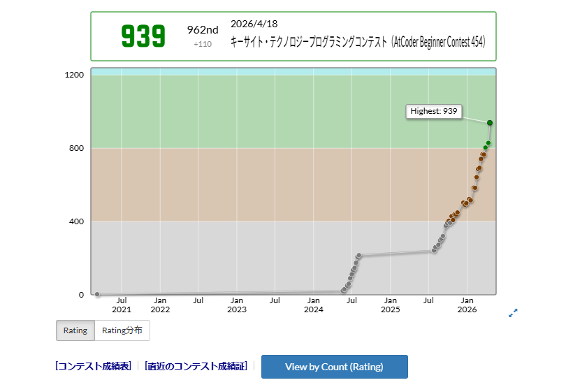
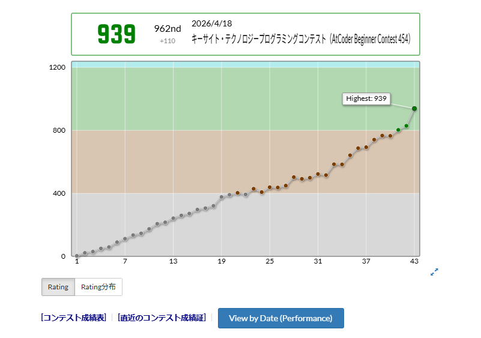
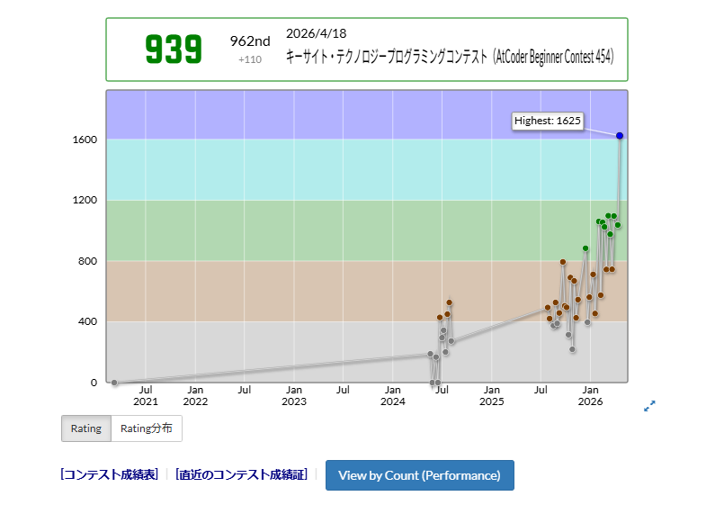
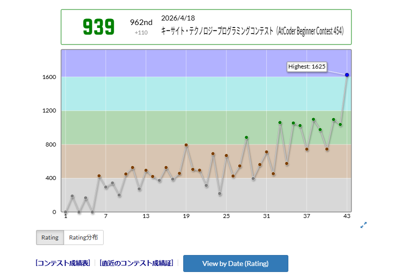

# AtCoder More Graphs

AtCoderのユーザーページにおけるレーティンググラフの機能を拡張するTampermonkey用ユーザースクリプトです。  
横軸を「年月日」⇔「参加回数」に切り替えられるほか、パフォーマンスのグラフ表示にも対応しています。

<div style="display: flex; gap: 5px; width: 400px;">


</div>
<div style="padding-top: 5px; display: flex; gap: 5px; width: 400px;">


</div>

## 主な機能
- 日付ベース / 参加回数ベースのグラフ切り替え
- パフォーマンス（Performance）グラフの表示
- ユーザーページのみで動作

## 動作環境
- Node.js, npm / yarn
- ユーザースクリプト管理ツール（例: Tampermonkey）

## ビルド手順
```bash
npm install
npm run build
```
または
```bash
yarn install
yarn run build
```

## 対象ページ
- `https://atcoder.jp/users/*`

## 注意
AtCoderのユーザーページの仕様変更によって動作しなくなる可能性があります。

## ライセンス
[MIT](LICENSE)
